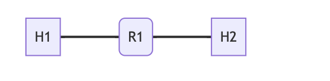
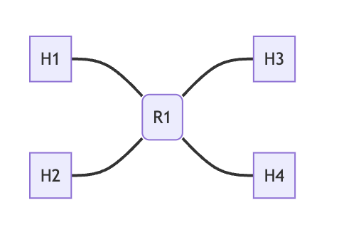
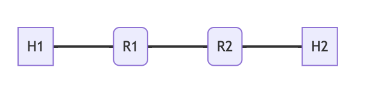
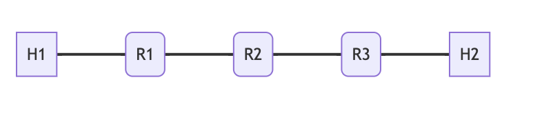
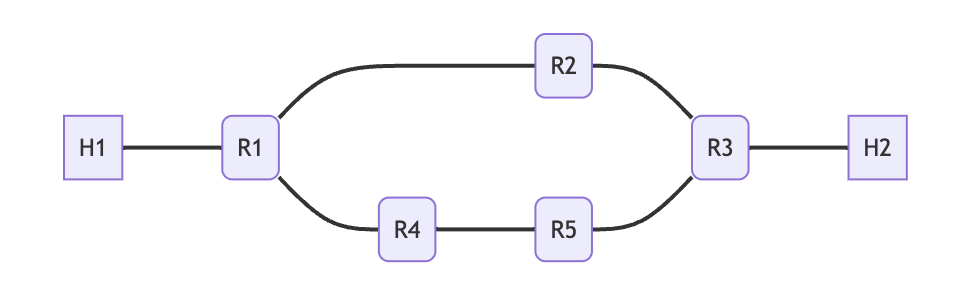

# TCP

A TCP Network Stack built off an IP Network Stack for CS1680 (Computer Networks) in Go with Matthias Yee.

Details:

- Developed a TCP stack and state machine with custom socket APIs for Docker-based virtual networks, achieving 96%
  transmission success by implementing stateful packet handling, dynamic buffer management, and connection state tracking
- Designed event-driven routines for retransmission, zero-window probing, and connection teardown, reducing packet loss and
  ensuring seamless data flow, successfully transmitting a 2MB file in 0.704 seconds
- Built a virtual IP stack with IPv4 headers, implementing custom APIs for hosts & routers and integrating RIP with
  split-horizon and poison-reverse, reducing convergence time with optimized triggered route broadcasting and triggered updates

### Example of networks

#### Linear-r1h2

A router with two interfaces, and a host connected to each interface.

#### Linear-r1h4

A router with two interfaces, and two hosts connected to each interface. Allowed us to test forwarding between subnets on one router allowing to send packets to different neighbours on th same subnet

#### Linear-r2h2

Two routers, with one host on each, and a link between them. This allowed us to test our RIP (Routing Information Protocol).

#### Linear-r3h2

Three routers, with hosts on the endpoints. This also allowed us to test RIP–the key here was to share updated information in our routing table.

#### loop

A network with a loop, where there are two paths from H1-H2 with different costs. We used this to check that RIP converges with lowest-cost path.

### Performance metrics:

When sending a 2mb file on the linear-r1h2 network with no packet drops, the performance is as follow as per the output from wireshark:

- Reference implementation: 0.175852042 s with 4085 packets sent
- Our implementation: 0.704090458 s with 3151 packets sent

Our wireshark packet capture is in the file called `performance_check_wireshark` which you can upload onto wireshark to view the packets directly. This is when we tested sending a 2mb file on the linear-r1h2 from h1 (10.0.0.1) to h2 (10.1.0.2) using a drop rate of 0.02. The wireshark shows the side of the sf port (a.k.a h1 at 10.0.0.1). We can see the `3 way handshake at line number 1,2,3` on the packet capture. One example of a `segment that is sent and acknolwedged is at line number 7 and 39`. One example of a `segment that is retransmitted is at line 314`. The `connection tear down starts at line 1562 and resumes in lines 1582, 1583 and 1584`.

Note: To respect Brown's academic code, this is a placeholder repo. If you are a potential employer and would like access to the code, please contact me at aryan_singh@brown.edu
